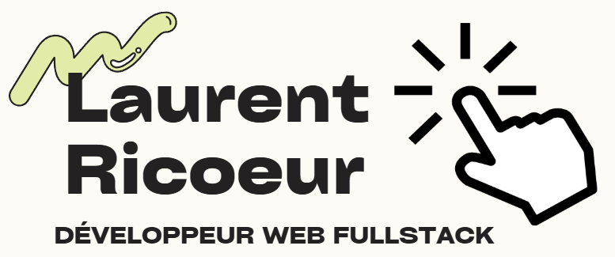

# Salut 👋 moi c’est Laurent
**Développeur Web Fullstack** (ex-manager reconverti).  
Je conçois des apps utiles et bien fichues… et je documente ce que je fais.

- 💻  Télécharger mon CV : 

## 🚀 Projets
- **ZombieLand** — App fullstack (Next.js, Express, PostgreSQL, Stripe) – *projet d’équipe (Scrum)*  
  👉 https://github.com/Ricoeur-Laurent/Zombieland
 
- **LBS-Project** — Site vitrine (en cours) avec paiement & BDD (Next.js)  
  👉 https://github.com/Ricoeur-Laurent/LBS-Project

## 💻 Stack technique

### 🧩 Langages & Bases

### 🛠️ Backend

### ⚛️ Frontend

### 🗄️ BDD & DevOps

### 🧰 Méthodo & Outils

## 👋 Contact
- ✉️  ricoeurlaurent@gmail.com  
- 💼  https://linkedin.com/in/laurent-ricoeur
